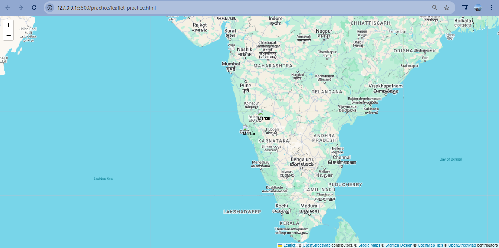
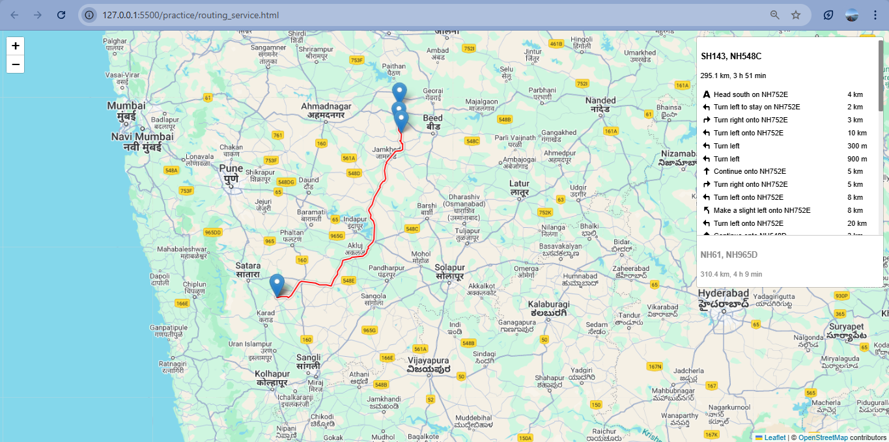
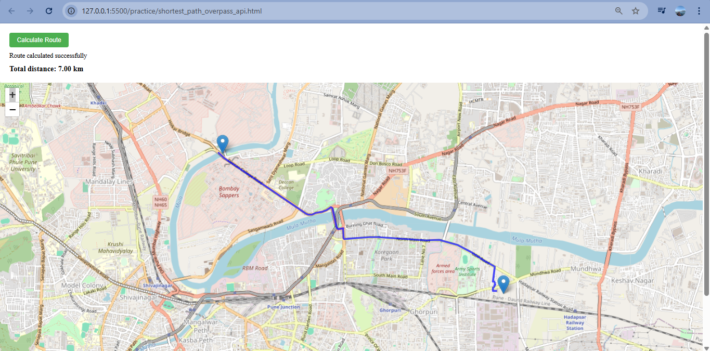
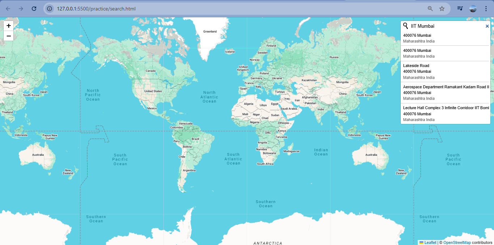
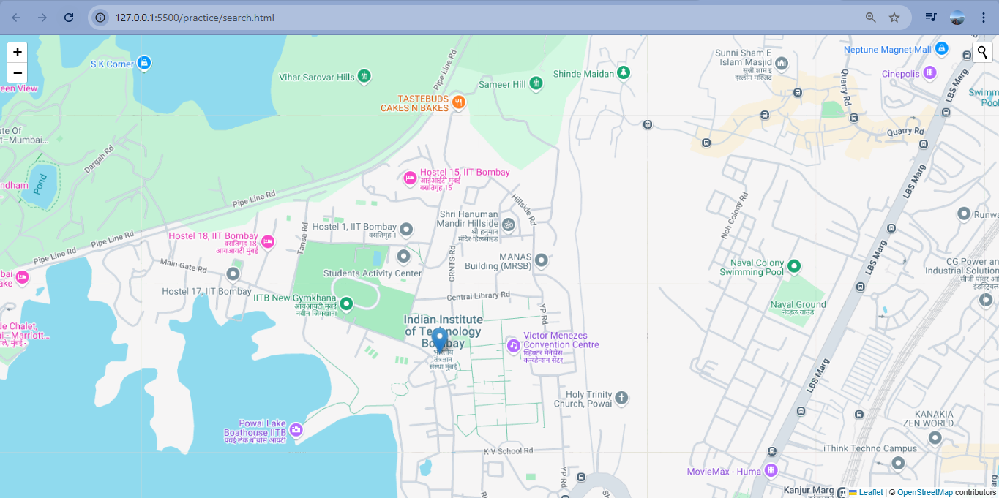

# 🗺️ OpenStreetMap Routing & Geo Visualization Project

> 🚧 **Status**: *In Progress*
> 📦 **Tech Stack**: `Leaflet.js`, `JavaScript (ES6+)`, `GeoJSON`, `Overpass API`, `C++`, `Node.js`, `Flask`, `MySQL`, `HTML5`, `CSS3`

---

## ✨ Overview

This multi-component project showcases **interactive geographic applications** for pathfinding, map visualization, and routing using **OpenStreetMap** data. It combines **client-side mapping** and **graph algorithms** with different technologies such as **Leaflet**, **Dijkstra’s Algorithm**, and **Overpass API**.

---

## 🔧 Features and Components

### 📍 `cpp_algo.cpp` — *Console-Based Shortest Path Finder*

> 🚀 **Language**: C++
> 🔗 **Purpose**: Compute shortest paths on a predefined city network using **Dijkstra’s Algorithm**

* 🧠 Predefined cities (e.g., `MIT_ADTU`, `Hadapsar`, `Kharadi`) are connected via weighted edges (distances).
* 📥 User inputs source and destination by number.
* 🗺️ Outputs shortest route and total distance.

#### ▶️ How to Run:

```bash
g++ cpp_algo.cpp -o cpp_algo
./cpp_algo
```

---

### 🗺️ `leaflet_practice.html` — *Layered Leaflet Map with Markers & GeoJSON*

> 🌐 **Tech**: HTML, Leaflet.js, GeoJSON
> 📍 **Purpose**: Display multiple tile layers and spatial data with interactivity

* 📌 Custom **draggable markers** with popups.
* 📊 Supports loading `point.js` and `map.js` for **GeoJSON** overlay.
* 🗺️ Switch between **OpenStreetMap**, **Stamen Terrain**, and **Google Maps**.

#### 💡 To Use:

```bash
open leaflet_practice.html
```

---

### 🧭 `routing_service.html` — *Visual Route Animation with Leaflet Routing Machine*

> 📌 **Tech**: Leaflet.js + Leaflet Routing Machine
> 📍 **Purpose**: Select start & destination on the map to generate real-time animated routing.

* ✅ Click once to choose **start**, and again for **destination**.
* 🚴 Auto-animates a route and traces it live on the map.
* 🗺️ Supports base map switching and overlays.

#### 💡 How to Launch:

```bash
open routing_service.html
```

---

### 🌐 `shortest_path_overpass_api.html` — *Dynamic Pathfinding Using Real OSM Data*

> 🌍 **Tech**: Leaflet.js + Overpass API + Dijkstra + JS
> 🔎 **Purpose**: Find shortest routes by dynamically building a graph from live OSM road data.

* 🖱️ Click to set **start** and **end** points on a map.
* 🔄 Uses **Overpass API** to fetch road network in the clicked area.
* 🧮 Constructs a **Graph** in memory and applies **Dijkstra's algorithm**.
* 📏 Displays route on map and shows **total distance**.

#### 📦 External APIs:

* 🌐 OpenStreetMap (Tiles)
* 🚀 Overpass API (OSM Roads)
* 📍 Leaflet Control Geocoder (optional)

#### 💡 How to Use:

```bash
open shortest_path_overpass_api.html
```


---
🔍 search.html
🔎 Tech: Leaflet.js + Leaflet Control Geocoder
🔍 Function: Implements an interactive address search on the map.

Uses OpenStreetMap + Google Maps layers

Users can search for locations using built-in geocoder

Automatically pans to the searched location

```bash
open search.html
```


---

### 🗂️ `point.geojson`

> 📌 Standard GeoJSON file containing feature data (points, shapes, etc.)

* 🔹 Used for spatial overlays in mapping interfaces
* 🔗 Often consumed by `leaflet_practice.html`

---

## 📁 Additional Files

| File                | Purpose                                                                            |
| ------------------- | ---------------------------------------------------------------------------------- |
| `package.json`      | Declares dependencies like `prompt-sync` (for Node)                                |
| `package-lock.json` | Lock file for consistent Node module versions                                      |
| `requirements.txt`  | Python dependencies (`flask`, `mysql-connector`) for potential backend integration |

---

## 🚧 Work in Progress

* ✅ Multiple map-based tools functional
* 🔄 More API integrations and server-side support planned
* 🛠️ UI improvements and real-time features to be added
* 📊 Possible dashboard integration with Flask + MySQL

---

## 📬 Get Involved / To Do

* [ ] Add UI controls for map features
* [ ] Cache OSM responses for offline use
* [ ] Backend APIs with Flask to store routing logs
* [ ] Visualize historical routes and usage analytics

---


